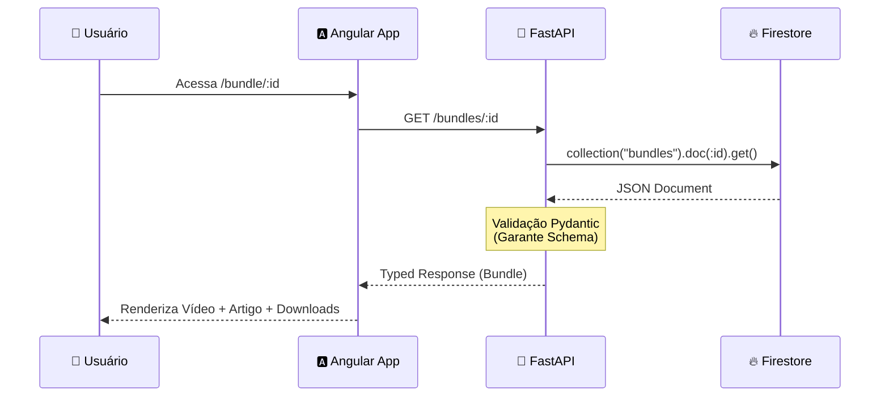

# 🏗️ Architecture Overview

Este documento descreve as decisões técnicas e o fluxo de dados do **Lamed**.

---

## ⚡ Tech Stack

| Camada       | Tecnologia                                                                                 | Detalhes                                 |
| :----------- | :----------------------------------------------------------------------------------------- | :--------------------------------------- |
| **Frontend** |   | Standalone Components, Signals, PrimeNG. |
| **Backend**  |       | Python 3.14, Pydantic v2.                |
| **Database** |  | NoSQL, realtime updates.                 |
| **Build**    |          | Docker Compose para orquestração local.  |

---

## 🔄 Fluxo de Dados: "Weekly Bundle"

O diagrama abaixo ilustra como o conteúdo de estudo (Bundle) viaja do banco de dados até a tela do usuário.

---

## 🧩 Componentes Chave

### Frontend (`/src/app`)

- **`BundleCardComponent`**:
  - _Responsabilidade_: Exibir resumo em cards nas listagens.
  - _Input_: `Bundle` object.
- **`BundleDetailComponent`**:
  - _Responsabilidade_: Página principal do estudo.
  - _Features_: Player de vídeo (YouTube Embed), Renderizador de HTML seguro, Lista de Downloads.

- **`AdminBundleManager`**:
  - _Responsabilidade_: CRUD de conteúdos.
  - _Acesso_: Protegido por Guard de Admin.

### Backend (`/backend`)

- **`main.py`**: Ponto de entrada da aplicação FastAPI.
- **`models.py`**: Definições de tipos compartilhados (Single Source of Truth).
- **`services/`**: Lógica de negócios (ex: sincronização com YouTube).

---

## 🔒 Segurança e Regras

> [!WARNING]
> **Firestore Rules**: O acesso direto ao Firestore pelo Frontend deve ser restrito a leitura de documentos públicos. Escritas complexas devem passar pela API Python para validação.
