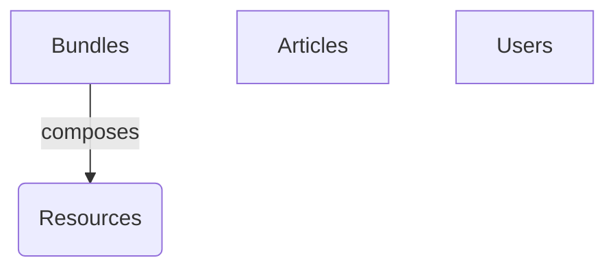

# 🔥 Firestore Schema Definitions

Este documento é a **Fonte da Verdade** para a estrutura de dados do Lamed. Qualquer alteração nos Models do backend (`models.py`) ou Interfaces do frontend deve ser refletida aqui.

---

## 📦 Collections Overview

### 1. `bundles`

Representa um pacote semanal de conteúdo de estudo. É a entidade central da aplicação.

| Campo             | Tipo        | Descrição                             | Obrigatório |
| :---------------- | :---------- | :------------------------------------ | :---------: |
| **id**            | `string`    | Auto-generated ID ou Slug.            |     ✅      |
| **title**         | `string`    | Título do estudo.                     |     ✅      |
| **week_number**   | `number`    | Número sequencial para ordenação.     |     ✅      |
| **description**   | `string`    | Resumo curto do conteúdo.             |     ✅      |
| **author**        | `string`    | Autor do conteúdo (Default: "Lamed"). |     ❌      |
| **published_at**  | `timestamp` | Data de publicação.                   |     ❌      |
| **is_active**     | `boolean`   | Se o conteúdo está visível no app.    |     ✅      |
| **video_id**      | `string`    | ID do vídeo na collection `videos`.   |     ❌      |
| **thumbnail_url** | `string`    | Capa do bundle.                       |     ❌      |
| **resources**     | `array`     | Lista de materiais de apoio.          |     ✅      |

#### 📎 Resources Structure

Itens baixáveis ou acessíveis dentro do bundle.

| Campo     | Tipo      | Valores Aceitos                                       |
| :-------- | :-------- | :---------------------------------------------------- |
| **title** | `string`  | Título do arquivo.                                    |
| **url**   | `string`  | Link direto (Storage/Drive).                          |
| **type**  | `literal` | `pdf`, `pptx`, `infographic`, `video`, `audio`, `doc` |

> [!NOTE]
> O tipo `video` em resources renderiza um botão de play ou um player secundário, diferente do vídeo principal.

---

### 2. `videos`

Collection independente para gestão de vídeos (desacoplada dos bundles).

| Campo             | Tipo        | Descrição                                        |
| :---------------- | :---------- | :----------------------------------------------- |
| **id**            | `string`    | YouTube ID ou ID gerado.                         |
| **title**         | `string`    | Título do vídeo.                                 |
| **description**   | `string`    | Descrição detalhada.                             |
| **url**           | `string`    | Link do YouTube.                                 |
| **thumbnail_url** | `string`    | URL da imagem de capa.                           |
| **published_at**  | `timestamp` | Data original de publicação.                     |
| **created_at**    | `timestamp` | Data de criação no sistema.                      |
| **author**        | `string`    | "Lamed" por padrão.                              |
| **is_active**     | `boolean`   | Visibilidade na galeria.                         |
| **provider**      | `string`    | `youtube` (atualmente o único player suportado). |

---

### 3. `articles`

Artigos de blog ou estudos independentes.

| Campo           | Tipo     | Descrição                     | Default                                |
| :-------------- | :------- | :---------------------------- | :------------------------------------- |
| **id**          | `string` | Slug único (ex: `a-criação`). | -                                      |
| **title**       | `string` | Manchete do artigo.           | -                                      |
| **summary**     | `string` | Texto de apoio/lead.          | -                                      |
| **content**     | `string` | HTML rico (ckeditor/quill).   | -                                      |
| **cover_image** | `string` | Imagem de destaque.           | `assets/Imagens/Fundo_Lamed-total.png` |
| **tags**        | `array`  | Strings para busca.           | `[]`                                   |

> [!IMPORTANT]
> Se `cover_image` não for fornecida, o sistema DEVE usar o fallback apontado acima.

---

### 3. `users`

Dados estendidos de usuários (Auth).

| Campo                   | Tipo     | Descrição                            |
| :---------------------- | :------- | :----------------------------------- |
| **uid**                 | `string` | Link com Firebase Auth.              |
| **subscription_status** | `string` | `active` \| `inactive` \| `past_due` |
