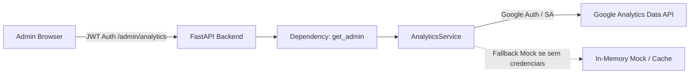

<!--
================================================================================
LOG DE MANUTENÇÃO DE DOCUMENTAÇÃO
--------------------------------------------------------------------------------
Data       | Autor          | Descrição
--------------------------------------------------------------------------------
2026-09-19 | Antigravity AI | Registro de Decisão Arquitetural: Google Analytics Data API.
================================================================================
-->

# ADR 0001: Integração Server-Side com Google Analytics Data API para o Painel Administrativo

## Status
**Implementada** (2026-09-19)

---

## Contexto

O painel administrativo do Lamed necessitava de visibilidade analítica em tempo real e consolidação de métricas de audiência (sessões, usuários ativos, páginas mais visitadas e fontes de tráfego) para orientar a produção de conteúdo teológico e apoiar a gestão comunitária.

### Riscos Identificados e Problemas a Resolver
1. **Exposição de Credenciais no Client:** Chamar APIs de métricas diretamente no navegador do cliente administrativo exigiria expor Service Accounts ou tokens OAuth de longa duração, gerando risco crítico de vazamento de credenciais.
2. **Rate Limiting & Latência:** Requisições frequentes à API do Google Analytics (v1beta) podem exceder quotas de requisição caso não haja camada intermediária com cache inteligente e circuit-breaker gracioso.
3. **Segurança de Acesso (Anti-IDOR):** As métricas de desempenho e dados de audiência são sensíveis e devem ser restritas exclusivamente a usuários autenticados com o perfil de administrador (`get_admin`).

---

## 1. Fundamentação Jurídica & Fontes Normativas Diretas
- **LGPD (Lei nº 13.709/2018):** Minimização de dados e segurança de registros analíticos agregados.
- **OWASP Top 10 (2025):** Prevenção de quebra de controle de acesso (A01: Broken Access Control) e falhas de identificação e autenticação (A07).

---

## 2. Decisão de Arquitetura

Optou-se por uma arquitetura **BFF (Backend-for-Frontend)** com proxy autenticado no backend FastAPI:
- O backend encapsula a biblioteca oficial `google-analytics-data` com o `AnalyticsService`.
- Todas as rotas em `/admin/analytics/*` exigem a dependência de autorização `Depends(get_admin)`.
- O serviço implementa fallback transparente com mock de desenvolvimento caso as credenciais não estejam configuradas em ambiente local, evitando falhas de inicialização.

---

## 3. Matriz de Implementação Técnica (*IN-CODE*)

### Backend (FastAPI / Python)
- `backend/services/analytics_service.py`: Classe singleton `AnalyticsService` responsável pela autenticação, consulta de métricas (sessões, engajamento, top pages, canais) e sanitização.
- `backend/routes/analytics.py`: Endpoints REST (`/status`, `/overview`, `/realtime`, `/top-content`, `/traffic-sources`) protegidos por `get_admin`.
- `backend/tests/test_analytics_api.py`: Suíte de testes unitários validando proteção por autenticação, serialização de dados e tratamento de erros.

### Frontend (Angular / TypeScript)
- `frontend/src/app/services/admin-analytics.service.ts`: Serviço tipado de consumo das rotas analíticas via `HttpClient`.
- `frontend/src/app/admin/dashboard/`: Componente de dashboard enriquecido com KPIs de audiência, fontes de tráfego e páginas populares.

---

## 4. Matriz de Conformidade e Mitigação de Riscos

| Risco Técnico | Medida Mitigatória Implementada |
| :--- | :--- |
| Vazamento de Service Account | Credenciais lidas estritamente de variáveis de ambiente (`GA_SERVICE_ACCOUNT_KEY` ou `GOOGLE_APPLICATION_CREDENTIALS`). |
| Acesso não autorizado | Bloqueio estrito via middleware `get_admin` com retorno `401 Unauthorized` ou `403 Forbidden`. |
| Falha de conectividade externa | Blocos `try/except` robustos que retornam payload vazio seguro em vez de crashar a requisição (`500`). |

---

## 5. Consequências e Resultados

### Positivas
- **Visibilidade Operacional Centralizada:** Métricas integradas ao dashboard do Lamed sem necessidade de login manual no console do Google Analytics.
- **Isolamento de Segurança:** Nenhuma chave ou token do Google trafega para o navegador.
- **Desenvolvimento Desacoplado:** O mock automático permite que desenvolvedores criem componentes de UI mesmo sem acesso à conta de produção do GA4.

### Mitigações e Desafios Gerenciados
- As chamadas externas ao GA4 adicionam latência de ~200-500ms na primeira requisição; uma camada de cache em memória com TTL de 5 minutos pode ser avaliada para otimização futura.
