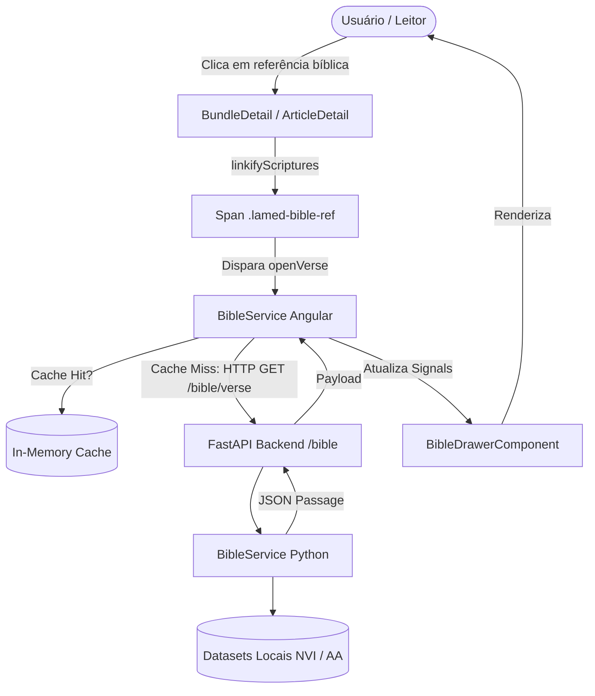

<!--
================================================================================
LOG DE MANUTENÇÃO DE DOCUMENTAÇÃO
--------------------------------------------------------------------------------
Data       | Autor          | Descrição
--------------------------------------------------------------------------------
2026-09-19 | Antigravity AI | Registro de Decisão Arquitetural: Motor Bíblico e Drawer Interativo.
================================================================================
-->

# ADR 0002: Motor Bíblico Local Server-Side e Drawer de Leitura Interativa nas Páginas de Estudo

## Status
**Implementada** (2026-09-19)

---

## Contexto

A plataforma Lamed disponibiliza semanalmente estudos aprofundados (bundles) e artigos teológicos com dezenas de referências bíblicas (ex: *"João 3:16"*, *"Romanos 8:28"*, *"Sl 23:1-4"*). Anteriormente, o leitor precisava alternar entre o aplicativo e uma Bíblia física ou outro aplicativo terceiro para conferir o texto sagrado, provocando quebra de fluxo de leitura, perda de engajamento e aumento de taxa de rejeição (*bounce rate*).

### Riscos Identificados e Problemas a Resolver
1. **Fricção Cognitiva e Saída da Aplicação:** A ausência de consulta inline forçava os membros a abandonarem a página de estudo para conferir versículos citados.
2. **Dependência e Custo de APIs Externas:** Consumir APIs bíblicas de terceiros em runtime introduz riscos de indisponibilidade externa, latência excessiva, quotas de requisição e inconsistência de versões textuais.
3. **Ergonomia e Acessibilidade Mobile:** Em dispositivos móveis, abrir modais invasivos ou popups bloqueantes degrada a experiência táctil. A leitura bíblica exige um drawer lateral fluido, acessível via teclado (`Escape`), com suporte a temas e alternância rápida de versões (NVI / AA).

---

## 1. Fundamentação Jurídica & Fontes Normativas Diretas
- **LGPD (Lei nº 13.709/2018):** Operação estritamente *stateless* e sem rastreamento desnecessário na consulta bíblica; respeito à privacidade dos hábitos de leitura.
- **WCAG 2.2 (Nível AA):** Acessibilidade em componentes modais/drawers com trapping de foco, tecla `Escape`, contraste visual e atributos ARIA (`role="dialog"`, `aria-modal="true"`).

---

## 2. Decisão de Arquitetura

Optou-se por um **motor bíblico local no backend FastAPI** alimentado por datasets canônicos estruturados em JSON (`pt_nvi.json` e `pt_aa.json`), combinado a um **Drawer interativo reativo no frontend Angular 20**:
- **Backend (`BibleService`):** Singleton em memória com mapeamento canônico de 66 livros bíblicos, suporte a abreviações universais, resolução de capítulos/versículos em O(1) e endpoint de parsing sintático.
- **Frontend (`BibleService` + `BibleDrawerComponent`):** Gerenciamento de estado puramente reativo via Angular Signals, cache in-memory de passagens consultadas e utilitário `linkifyScriptures` que transforma referências em texto HTML sem corromper atributos.

---

## 3. Matriz de Implementação Técnica (*IN-CODE*)

### Backend (FastAPI / Python)
- `backend/services/bible_service.py`: Serviço de normalização de referências, carregamento lazy dos datasets bíblicos, fatiamento de versículos e recuperação de capítulos completos.
- `backend/routes/bible.py`: Rotas REST (`/verse`, `/chapter`, `/books`, `/parse`) com tipagem estrita, parâmetros de consulta e validações de erro 400/404.
- `backend/main.py`: Registro do roteador `/bible`.
- `backend/tests/test_bible_api.py`: Suíte de testes unitários cobrindo consultas de versículos, intervalos, capítulos inteiros e tratamento de erros.

### Frontend (Angular 20 / TypeScript)
- `frontend/src/app/core/services/bible.service.ts`: Serviço central baseado em Signals para controle de abertura do drawer, alternância de versões (NVI / AA), modo de visualização (versículo vs capítulo) e cache local.
- `frontend/src/app/core/utils/bible-reference.utils.ts`: Regex inteligente e parser HTML para linkificação automática de citações bíblicas sem alterar tags HTML já existentes.
- `frontend/src/app/componentes/shared/bible-drawer/`: Componente de Drawer responsivo com micro-interações, suporte a teclado (ESC), cópia de texto para a área de transferência e destaque do versículo pesquisado.
- `frontend/src/app/pages/bundle-detail/` e `frontend/src/app/pages/article-detail/`: Integração da linkificação nas seções de estudo e binding de eventos de clique.
- `frontend/src/app/app.html` e `frontend/src/app/app.ts`: Inclusão global do `<app-bible-drawer />`.

---

## 4. Matriz de Ações de Governança & Jurídicas (*OFF-CODE*)
- **Domínio Público & Direitos:** Assegurar que as traduções integradas atendam aos termos de citação e estudo cristão sem fins lucrativos.
- **Auditoria de Performance:** Monitoramento do tempo de resposta do endpoint `/bible/verse` (< 15ms em média devido à estrutura indexada em memória).

---

## 5. Prazos Legais de Guarda e Políticas de Retenção
- Como as consultas bíblicas não processam nem armazenam dados pessoais identificáveis (PII), não há criação de registros de retenção vinculados ao usuário.

---

## 6. Matriz de Conformidade e Mitigação de Riscos

| Risco | Probabilidade | Impacto | Estratégia de Mitigação |
| :--- | :---: | :---: | :--- |
| **Erros de Parse em Citações Raras** | Média | Baixo | Dicionário canônico abrangente com aliases para variações de nomes dos livros e normalização NFD. |
| **Queda de Conexão no Leitor** | Baixa | Médio | Cache em memória no cliente Angular para passagens já visualizadas na sessão. |
| **Sobrecarga de Renderização no DOM** | Baixa | Baixo | Processamento de linkificação fatiado por nós de texto plano, preservando nós HTML nativos. |

---

## 7. Consequências e Resultados

### Positivas
- **Imersão Completa:** O usuário estuda o conteúdo sem necessidade de sair da página ou trocar de aba.
- **Zero Custo de API Externa:** Dados 100% locais no container do backend, com alta velocidade de resposta.
- **Multitradução Instantânea:** Alternância imediata entre Nova Versão Internacional (NVI) e Almeida Atualizada (AA).
- **Leitura em Contexto:** Botão direto para expandir e ler o capítulo inteiro com destaque do versículo original.

### Mitigações e Desafios Gerenciados
- **Volume de Dados:** Os arquivos JSON das Bíblias foram mantidos em disco local e são carregados sob demanda apenas uma vez no ciclo de vida do servidor.
