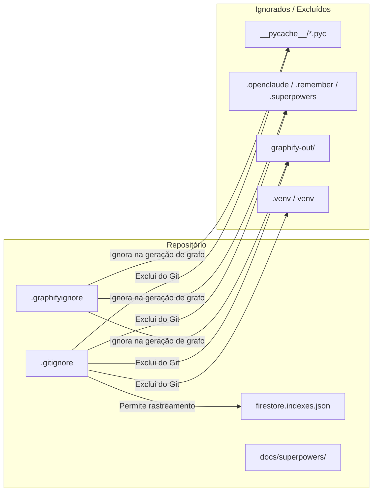

---

# 📝 Registro de Desenvolvimento — 2026-08-12

**Escopo:** Atualização de `.gitignore`, `.graphifyignore`, desrastreamento de arquivos `.pyc` compilados e rastreamento de índices do Firestore e documentação do Superpowers.
**Commits gerados:** 3
**Arquivos modificados/adicionados/removidos:** 19

---

## 1. Visão Geral das Alterações

> Nesta sessão, refinamos os arquivos de ignorar do Git (`.gitignore`) e do Graphify (`.graphifyignore`) para excluir de forma consistente diretórios de cache Python, arquivos compilados `.pyc`, ambientes virtuais, arquivos de estado de agentes e ferramentas de IA (`.openclaude`, `.remember`, `.superpowers`, `graphify-out`). Além disso, removemos do índice do Git os arquivos `.pyc` que haviam sido comitados no passado e passamos a rastrear as configurações do Firestore (`firestore.indexes.json`).

---

## 2. Arquitetura Afetada

---

## 3. Mapa de Arquivos Modificados

| Arquivo | Tipo | O que mudou |
|--------|------|-------------|
| `.gitignore` | Configuração | Atualizadas regras de exclusão recursiva para `__pycache__`, ferramentas de IA, ambientes virtuais e regras de exceção JSON |
| `.graphifyignore` | Configuração | Criado arquivo de configuração do Graphify com exclusão de caches, binários, mídias e agentes |
| `backend/**/__pycache__/*.pyc` (13 arquivos) | Bytecode | Removidos do índice do Git (`git rm --cached`) |
| `firestore.indexes.json` | Configuração Firebase | Adicionado ao rastreamento do Git na raiz |
| `backend/firestore.indexes.json` | Configuração Firebase | Adicionado ao rastreamento do Git na pasta backend |
| `docs/superpowers/specs/2026-08-12-videos-shorts-cleanup-design.md` | Documentação | Adicionada especificação de arquitetura para limpeza de shorts |
| `docs/superpowers/plans/2026-08-12-videos-shorts-cleanup.md` | Documentação | Adicionado plano de implementação para limpeza de shorts |

---

## 4. Detalhamento por Commit

### `chore(repo): update gitignore, graphifyignore and untrack pyc files`

**Razão da alteração:**
> Evitar poluição no histórico do Git e vazamento de arquivos binários compilados ou estados de sessão de IA.

**O que faz agora:**
> O Git ignora recursivamente qualquer pasta `__pycache__`, extensões `.pyc`, pastas de agentes de IA (`.openclaude`, `.remember`, `.superpowers`) e saída do Graphify (`graphify-out/`).

**Decisões técnicas:**
> Troca da regra `/backend/__pycache__/` por `__pycache__/` global para cobrir subdiretórios em `backend/api`, `backend/routes`, `backend/content`, etc.

**Arquivos envolvidos:**
- `.gitignore` — regras de exclusão atualizadas
- `.graphifyignore` — novo arquivo de ignore para o Graphify
- 13 arquivos `backend/**/__pycache__/*.pyc` — removidos do índice do Git

---

### `chore(firebase): track firestore index definitions`

**Razão da alteração:**
> Permitir que definições de índices de banco de dados Firestore fiquem versionadas no repositório.

**O que faz agora:**
> Os arquivos `firestore.indexes.json` na raiz e no backend são rastreados normalmente.

**Decisões técnicas:**
> Inclusão da exceção `!firestore.indexes.json` e `!**/firestore.indexes.json` no `.gitignore`.

**Arquivos envolvidos:**
- `firestore.indexes.json`
- `backend/firestore.indexes.json`

---

### `docs(superpowers): add design spec and plan for videos shorts cleanup`

**Razão da alteração:**
> Registrar especificação técnica e plano de execução para limpeza de vídeos shorts.

**O que faz agora:**
> Documentação mantida e rastreada no diretório `docs/superpowers/`.

**Decisões técnicas:**
> Mantidos em `docs/superpowers/` para fácil consulta e rastreabilidade da equipe.

**Arquivos envolvidos:**
- `docs/superpowers/specs/2026-08-12-videos-shorts-cleanup-design.md`
- `docs/superpowers/plans/2026-08-12-videos-shorts-cleanup.md`

---

## 5. ✅ O Que Está Funcionando

- `.gitignore` aplicando regras recursivas limpas sem duplicações.
- `.graphifyignore` cobrindo caches, binários e artefatos de IA.
- Nenhuns arquivos `.pyc` rastreados pelo Git (`git status` limpo).
- Índices do Firestore rastreados corretamente.

---

## 6. ❌ O Que Está Pendente

- Nenhuma pendência identificada neste escopo.

---

## 7. ⚠️ Dívida Técnica Identificada

- Nenhuma dívida técnica encontrada nas alterações de configuração.

---

## 8. Padrões Importantes a Lembrar

- Sempre usar `__pycache__/` sem barra inicial no `.gitignore` para ignorar diretórios de cache Python em qualquer nível de profundidade.
- Arquivos `.indexes.json` do Firestore devem ser versionados para garantir paridade nos ambientes de dev e prod.

---

## 9. Próximos Passos

1. Prosseguir com as tarefas normais de desenvolvimento da aplicação.

---

## 10. Validações Mapeadas

| Campo / Função | Regra de validação | Status |
|---------------|-------------------|-------|
| `git status` | Não deve exibir arquivos `.pyc` nem pastas de cache | ✅ |
| `.graphifyignore` | Deve excluir pastas geradas e binários | ✅ |
