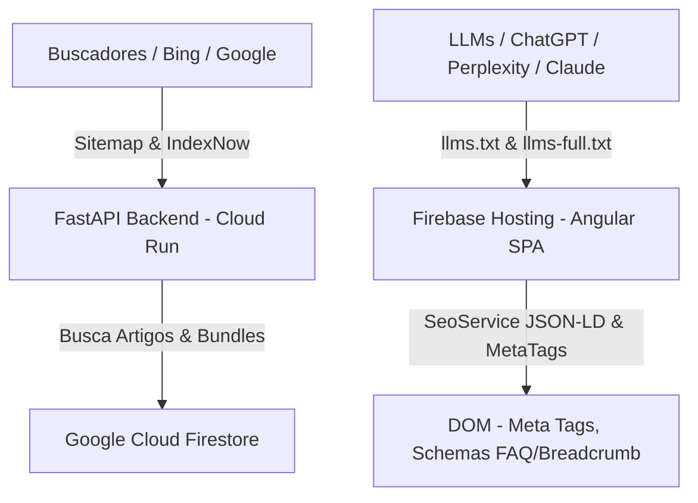

---

# 📝 Registro de Desenvolvimento — 12 de Agosto de 2026

**Escopo:** Otimização Global de SEO, AEO (Answer Engine Optimization), GEO (Generative Engine Optimization) e Integração IndexNow
**Commits gerados:** 5
**Arquivos modificados:** 32

---

## 1. Visão Geral das Alterações

> Nesta sessão, implementamos uma reestruturação completa de otimização de SEO, AEO e GEO para o ecossistema Lamed. Foram adicionados arquivos de índice para IAs (`llms.txt` e `llms-full.txt`), criados os endpoints de `sitemap.xml` dinâmico e `rss.xml` no FastAPI, implementada a integração com o protocolo IndexNow, expandidos os Schemas JSON-LD no Angular (`BreadcrumbList` e `FAQPage`) e corrigidas falhas de HTML semântico.

---

## 2. Arquitetura Afetada

---

## 3. Mapa de Arquivos Modificados

| Arquivo | Tipo | O que mudou |
|--------|------|-------------|
| `backend/routes/seo.py` | Endpoint / Service | Criados endpoints `/sitemap.xml`, `/rss.xml` e `/indexnow/ping-all` |
| `backend/main.py` | Configuration | Registro do router de SEO |
| `firebase.json` | Hosting Config | Adicionadas regras de rewrite para `/sitemap.xml` e `/rss.xml` |
| `frontend/public/llms.txt` | Asset Público | Arquivo padrão llmstxt.org para IAs |
| `frontend/public/llms-full.txt` | Asset Público | Documentação e base de conhecimento teológico para RAG |
| `frontend/public/b749f26556ab49f9a4f8409c5c88f525.txt` | Asset Público | Chave de verificação de domínio do IndexNow |
| `frontend/public/robots.txt` | Configuration | Liberados robôs de IA (GPTBot, PerplexityBot, ClaudeBot, etc.) |
| `frontend/src/index.html` | HTML Root | Adicionadas meta tags de fallback estáticas, theme-color e OG |
| `frontend/src/app/core/services/seo.service.ts` | Angular Service | Adicionado suporte a Breadcrumbs e FAQPage JSON-LD |
| `frontend/src/app/componentes/shared/header/header.html` | Template | Corrigido link do logo para `routerLink="/"` |
| `frontend/src/app/componentes/artigos/artigos.html` | Template | Removida tag `<main>` duplicada |
| `frontend/src/app/componentes/home/home.html` | Template | Unificada hierarquia do `<h1>` no hero |
| `package.json` / `frontend/package.json` | Configuration | Script `npm start` com `--host 0.0.0.0` |

---

## 4. Detalhamento por Commit

### `chore(scripts): configure npm start to bind to 0.0.0.0 for local network access`
**Razão da alteração:** Permitir acesso ao servidor de desenvolvimento Angular através do IP da rede local.
**O que faz agora:** `npm start` inicia o Angular CLI escutando na interface `0.0.0.0`.

### `feat(backend): add dynamic sitemap, rss feed, and indexnow endpoints`
**Razão da alteração:** O sitemap estático não incluía os artigos nem bundles cadastrados no Firestore.
**O que faz agora:** A API `/sitemap.xml` e `/rss.xml` compilam dinamicamente todas as URLs do site com tratamento seguro de datas e escape de caracteres XML. Além disso, a rota `/indexnow/ping-all` envia a lista de URLs ao protocolo IndexNow.

### `feat(seo): add llms.txt, llms-full.txt, indexnow key file, and update robots.txt`
**Razão da alteração:** Adequação ao padrão de otimização para Inteligências Artificiais e motores generativos.
**O que faz agora:** IAs possuem diretrizes de citação e contexto estruturado no `llms.txt` e `llms-full.txt`.

### `feat(frontend): enhance seo service with breadcrumbs/faq schemas and fix html semantics`
**Razão da alteração:** Expandir os dados estruturados e resolver avisos de acessibilidade do Lighthouse.
**O que faz agora:** Injeta Schemas JSON-LD de Breadcrumbs e FAQPage dinamicamente, corrige a duplicidade de `<main>` e `<h1>`.

---

## 5. ✅ O Que Está Funcionando

- [x] Sitemap XML dinâmico gerando URLs de páginas estáticas, artigos e bundles
- [x] Feed RSS 2.0 funcional em `/rss.xml`
- [x] Arquivos `llms.txt` e `llms-full.txt` no padrão [llmstxt.org](https://llmstxt.org)
- [x] Protocolo IndexNow integrado com chave de verificação
- [x] Meta tags de fallback, OpenGraph e Twitter Cards no `index.html`
- [x] Schemas JSON-LD dinâmicos para `BreadcrumbList` e `FAQPage`
- [x] Servidor Angular aceitando conexões no IP local (`0.0.0.0`)

---

## 6. ❌ O Que Está Pendente

- `[ ]` Deploy para ambiente de produção — *aguardando execução manual do comando `npm run deploy` pelo usuário*.

---

## 7. ⚠️ Dívida Técnica Identificada

- Nenhuma dívida técnica crítica introduzida nesta sessão.

---

## 8. Padrões Importantes a Lembrar

- Todas as URLs de arquivos XML (sitemap, rss) e manifestos para IAs devem utilizar o protocolo HTTPS e o domínio oficial (`https://lamed148.com.br`).

---

## 9. Próximos Passos

1. Executar o deploy no ambiente de produção (`npm run deploy`).
2. Cadastrar o sitemap no Google Search Console e Bing Webmaster Tools.
3. Disparar o endpoint POST `/indexnow/ping-all` em produção.

---

## 10. Validações Mapeadas

| Campo / Função | Regra de validação | Status |
|---------------|-------------------|-------|
| `/sitemap.xml` | XML válido com escape e datas ISO | ✅ |
| `/rss.xml` | RSS 2.0 válido com escape e datas GMT | ✅ |
| `/llms.txt` | Especificação Markdown llmstxt.org | ✅ |
| `/indexnow` | Envio de JSON com chave e URLs válidas | ✅ |
