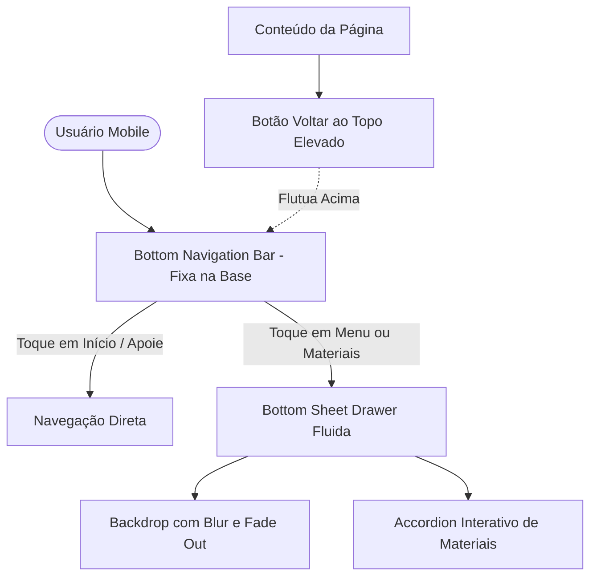

<!--
================================================================================
LOG DE MANUTENÇÃO DE DOCUMENTAÇÃO
--------------------------------------------------------------------------------
Data       | Autor          | Descrição
--------------------------------------------------------------------------------
2026-09-19 | Antigravity AI | Registro consolidado de desenvolvimento: refinamento
           |                | de navegação mobile e correção de warnings de template.
================================================================================
-->

# Registro de Desenvolvimento — 2026-09-19

| Metadado | Detalhe |
| :--- | :--- |
| **Escopo Principal** | `ui-mobile-navigation & admin-dashboard` |
| **Commits Gerados** | `2 commits de código (+1 de documentação)` |
| **Arquivos Modificados** | `5 arquivos de código` |
| **ADRs Vinculadas / Geradas** | `Nenhuma (Ajustes de UI/UX e polimento de templates)` |

---

## 1. Visão Geral das Alterações
Nesta sessão, refinamos a experiência de navegação mobile do Lamed após a introdução da Bottom Navigation Bar e do Bottom Sheet Drawer. Ajustamos as transições de abertura e fechamento para um padrão fluido acelerado por hardware (`translate3d` e desfoque gradual de backdrop), harmonizamos a estética do botão Apoie para manter a elegância vetorial da barra inferior com respeito à Home Bar do iOS, e elevamos o botão flutuante de voltar ao topo para eliminar sobreposição com a opção Menu. Adicionalmente, sanamos os 3 avisos `NG8107` de compilação no painel administrativo do Angular.

---

## 2. Arquitetura Afetada & Decisões (ADRs)
- **Decisões Registradas:**
  - Nenhuma nova ADR necessária: as alterações enquadram-se em polimento de interface, acessibilidade de toque e correção de sintaxe de templates.
- **Diagrama de Relações e Fluxos da Interface Mobile:**

---

## 3. Mapa de Arquivos Modificados

| Arquivo | Camada Técnica | Resumo da Modificação |
| :--- | :--- | :--- |
| `frontend/src/app/componentes/shared/header/header.html` | Apresentação / UI | Transição fluida do backdrop via classe `.open` e harmonização do botão Apoie |
| `frontend/src/app/componentes/shared/header/header.scss` | Apresentação / UI | Curvas de aceleração cúbica (`cubic-bezier`), remoção de corte por `display:none` e padding seguro do iPhone |
| `frontend/src/app/componentes/shared/footer/footer.scss` | Apresentação / UI | Elevação do botão `#back-to-top` acima da barra inferior no mobile |
| `frontend/src/app/app.scss` | Apresentação / Estilos | Regra global garantindo elevação segura de `#back-to-top` e padding no layout principal |
| `frontend/src/app/admin/dashboard/dashboard.component.html` | Apresentação / Admin | Substituição de `resources?.length` por `resources.length` eliminando warnings NG8107 |

---

## 4. Detalhamento por Commit

### `fix(ui): refinar transicoes da bottom-sheet, botao apoie e elevacao do botao topo no mobile`
- **Hash:** `329be1e`
- **Razão da alteração:** O menu drawer apresentava corte abrupto na saída, o botão Apoie tinha aspecto pesado com sombra borrada e o botão de voltar ao topo sobrepunha o botão Menu no mobile.
- **Comportamento atual:** A gaveta desce suavemente com desaceleração elástica e desvanecimento do backdrop, o botão Apoie é limpo e alinhado, e o botão voltar ao topo flutua com folga acima da navegação.
- **Arquivos envolvidos:**
  - `frontend/src/app/componentes/shared/header/header.html`
  - `frontend/src/app/componentes/shared/header/header.scss`
  - `frontend/src/app/componentes/shared/footer/footer.scss`
  - `frontend/src/app/app.scss`

### `fix(admin): remover encadeamento opcional redundante em recursos do dashboard`
- **Hash:** `358ecd8`
- **Razão da alteração:** O Angular Compiler emitia 3 warnings `NG8107` devido ao uso desnecessário de `?.` em um array estritamente tipado.
- **Comportamento atual:** O build do projeto executa de forma limpa, sem qualquer aviso de compilação em templates.
- **Arquivos envolvidos:**
  - `frontend/src/app/admin/dashboard/dashboard.component.html`

---

## 5. Dívida Técnica & Próximos Passos

- [ ] Executar auditoria com o script `ux_audit.py` e `accessibility_checker.py` nas demais páginas públicas no viewport mobile.
- [ ] Avaliar implementação de gestos de arraste para baixo (*swipe-to-dismiss*) na gaveta Bottom Sheet móvel.
