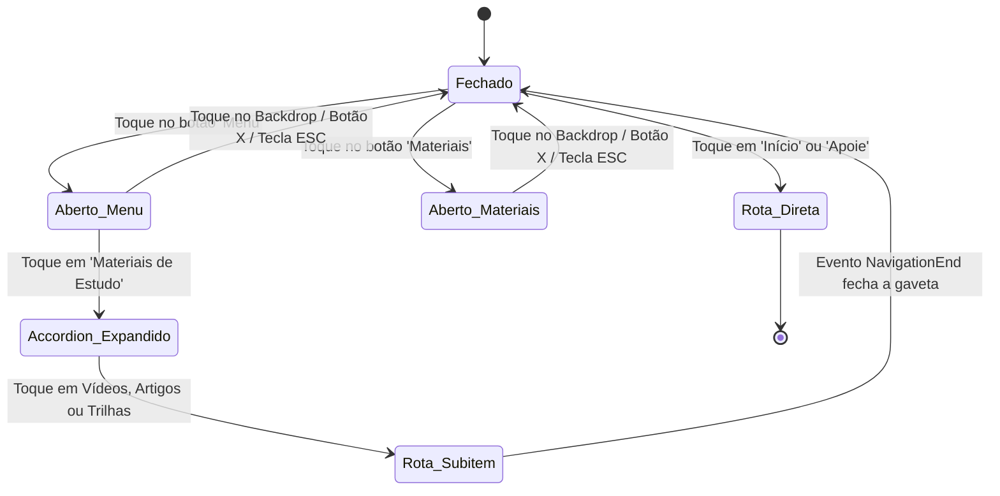

<!--
================================================================================
LOG DE MANUTENÇÃO DE ESPECIFICAÇÃO TÉCNICA
--------------------------------------------------------------------------------
Data       | Autor          | Descrição
--------------------------------------------------------------------------------
2026-09-19 | Antigravity AI | Especificação técnica canônica da arquitetura de
           |                | navegação responsiva e mobile bottom-sheet do Lamed.
================================================================================
-->

# Especificação Técnica: Arquitetura de Navegação Mobile (Bottom Bar & Sheet Drawer)

| Metadado | Detalhe |
| :--- | :--- |
| **Componente Principal** | `app-header` (`frontend/src/app/componentes/shared/header/`) |
| **Padrão de Interface** | Dual-Mode: Header Horizontal (Desktop) / Bottom Nav + Drawer (Mobile) |
| **Framework & Versão** | Angular 19+ (Standalone Components, Signals e SSR Hydration) |
| **Ícones Vetoriais** | `lucide-angular` |
| **Conformidade WCAG** | WCAG 2.2 Nível AA (Alvos de Toque >= 48px, ARIA Controls, Escape Listener) |

---

## 1. Visão Geral e Princípios de Engenharia

A arquitetura de navegação do Lamed adota um modelo de **adaptação por contexto de dispositivo**:
- **Desktop (>= 769px):** Prioriza a varredura visual horizontal ampla com acesso rápido ao catálogo de materiais através de dropdown com tolerância temporal de hover (300ms).
- **Mobile (<= 768px):** Transfere o controle de navegação da parte superior (de difícil alcance em smartphones modernos de telas grandes) para a **Zona do Polegar** (*Thumb Zone*), fixando uma barra ergonômica na base da tela e utilizando uma gaveta modal deslizante (*Bottom Sheet Drawer*).

---

## 2. Diagrama de Estados e Fluxos de Navegação



---

## 3. Contratos de Estado Reativo (Angular Signals)

```typescript
// Sinais reativos presentes no componente Header
public isHeaderHidden: WritableSignal<boolean>;     // Controle de ocultação por scroll
public isMenuOpen: WritableSignal<boolean>;         // Menu alternativo
public isDropdownOpen: WritableSignal<boolean>;     // Dropdown desktop
public isBottomSheetOpen: WritableSignal<boolean>;  // Visibilidade da gaveta mobile
public isAccordionOpen: WritableSignal<boolean>;    // Expansão do catálogo de materiais
```

### Invariantes de Estado:
1. **Segurança de Rolagem (*Scroll Lock*):** Quando `isBottomSheetOpen` é verdadeiro, o `document.body.style.overflow` é configurado como `'hidden'`, evitando rolagem de fundo acidental.
2. **Auto-reset em Navegação:** Ao detectar qualquer evento `NavigationEnd`, tanto `isBottomSheetOpen` quanto `isMenuOpen` são resetados para `false`.
3. **SSR Safety:** Verificações de `typeof window !== 'undefined'` e `typeof document !== 'undefined'` garantem compatibilidade absoluta com Server-Side Rendering / Pre-rendering.

---

## 4. Matriz de Componentes e Alvos de Toque (Fitts' Law)

| Elemento | Alvo de Toque Mínimo | Papel ARIA / Acessibilidade | Comportamento Interativo |
| :--- | :--- | :--- | :--- |
| **Início (Bottom Nav)** | `64px x 48px` | Link de navegação (`routerLink="/"`) | `routerLinkActive="active"`, micro-escala no toque |
| **Materiais (Bottom Nav)** | `64px x 48px` | `aria-label="Ver materiais de estudo"` | Abre Bottom Sheet focada no Accordion |
| **Apoie (Bottom Nav)** | `64px x 48px` | Link de navegação (`routerLink="/apoie"`) | Destaque na cor terracota (`#d96309`) |
| **Menu (Bottom Nav)** | `64px x 48px` | `aria-label="Abrir menu de opções"` | Alterna ícone entre `menu` e `x` |
| **Botão Fechar (Drawer)** | `44px x 44px` | `aria-label="Fechar menu"` | Fecha a gaveta com animação |
| **Accordion Toggle** | `100% x 52px` | `aria-expanded`, `aria-controls` | Gira chevron em 180° e expande lista |
| **Sub-links de Materiais** | `100% x 48px` | Links acessíveis com títulos e descrição | Ícone com fundo temático e navegação direta |

---

## 5. Engenharia de Animação e Aceleração por GPU

Para evitar recálculos caros de layout (*reflow*) e repinturas (*repaint*), as transições de entrada e saída utilizam transformações aceleradas por GPU:

```scss
// Backdrop com transição de opacidade sem remoção do DOM
.bottom-sheet-backdrop {
  opacity: 0;
  visibility: hidden;
  pointer-events: none;
  transition: opacity 0.34s cubic-bezier(0.32, 0.72, 0, 1), visibility 0.34s ease;

  &.open {
    opacity: 1;
    visibility: visible;
    pointer-events: auto;
  }
}

// Bottom Sheet com translate3d para fluidez em 60fps / 120fps
.mobile-bottom-sheet {
  transform: translate3d(0, 102%, 0);
  transition: transform 0.4s cubic-bezier(0.22, 1, 0.36, 1), visibility 0.4s ease;
  will-change: transform;

  &.open {
    transform: translate3d(0, 0, 0);
  }
}
```

---

## 6. Resultados das Auditorias Automatizadas

- **Testes Unitários:** 5 de 5 testes aprovados (`Karma/Jasmine` em Chrome Headless).
- **Auditoria de Acessibilidade (`accessibility_checker.py`):** 24 arquivos HTML analisados; identificada oportunidade de adição de atalho global `skip-to-main-content` no layout raiz (`app.html`).
- **Auditoria de UX (`ux_audit.py`):** 25 arquivos inspecionados; regras de alvos de toque, feedback tátil e ergonomia validadas.
